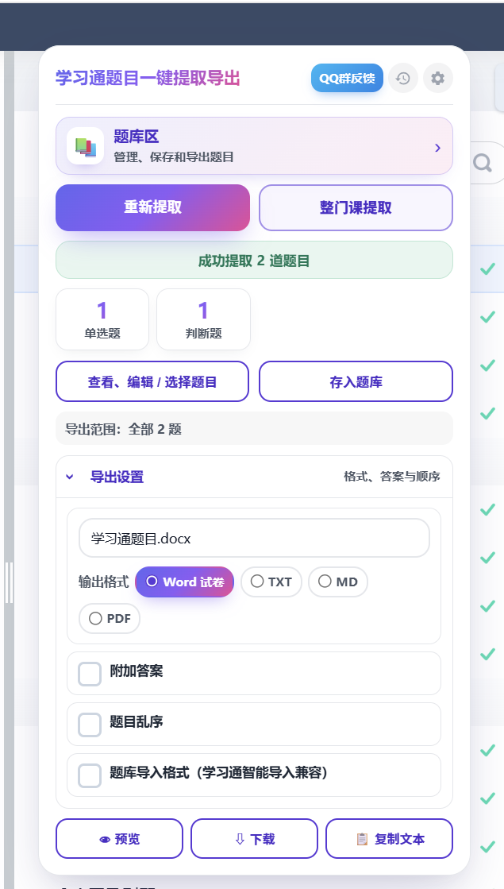
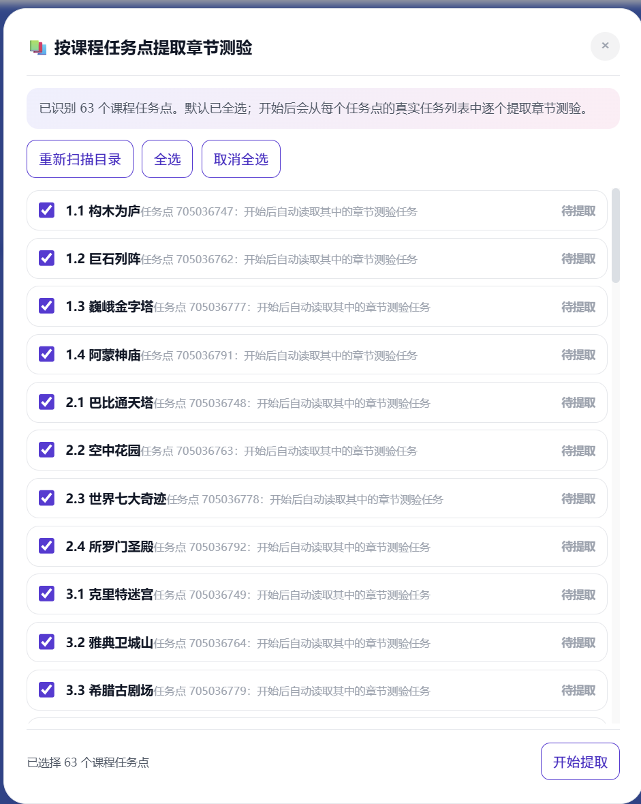
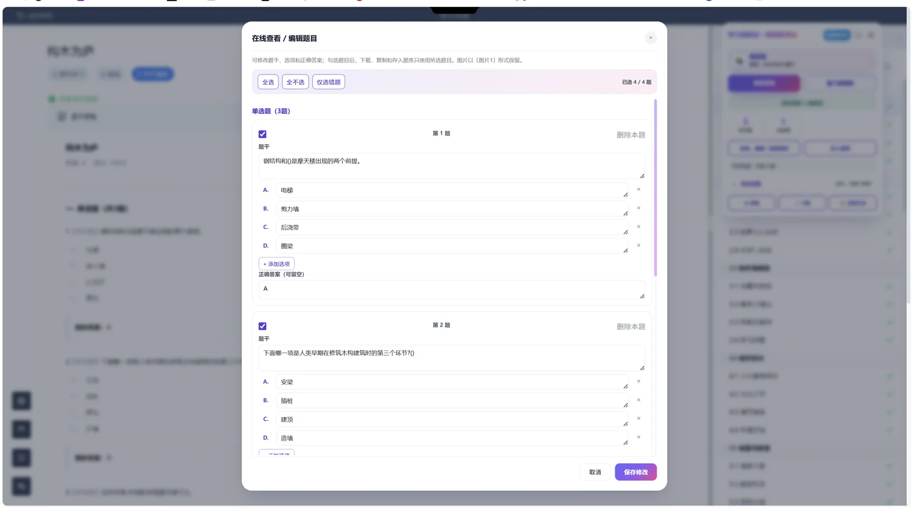
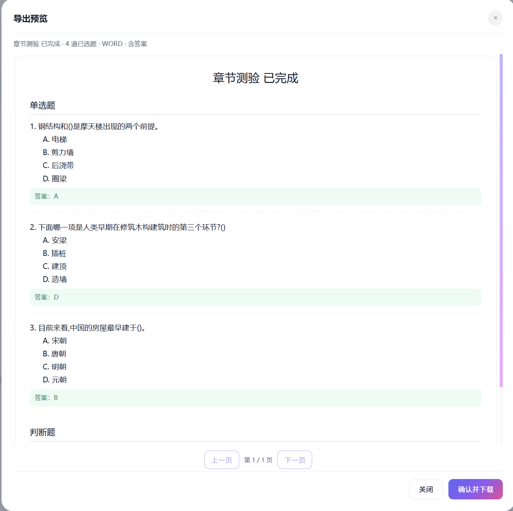
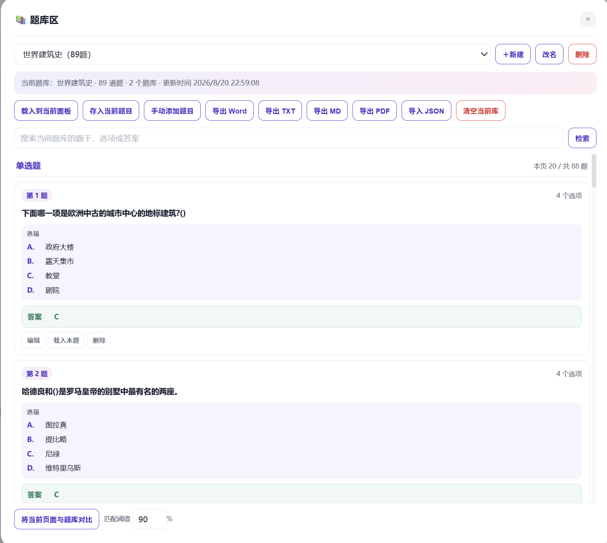

# 学习通题目导出

  面向学习通随堂测验、章节测验、作业与已批阅考试页面的浏览器用户脚本。 
  提取题目后可在线编辑、沉淀到题库，并导出为 Word、PDF、TXT 或 Markdown。

  
  
  

> 仅用于整理你有权查看的课程资料和已完成的练习记录。页面结构可能随学习通更新而变化；导出前请自行核对题目与答案。

## 目录

- [功能一览](#功能一览)
- [在线题库资源](#在线题库资源)
- [界面预览](#界面预览)
- [安装](#安装)
- [快速开始](#快速开始)
- [批量提取章节测验](#批量提取章节测验)
- [答案与错题处理](#答案与错题处理)
- [题库与在线编辑](#题库与在线编辑)
- [导出格式](#导出格式)
- [常见问题](#常见问题)
- [许可证](#许可证)

## 功能一览

| 功能 | 说明 |
| --- | --- |
| 本页提取 | 提取当前随堂测验、章节测验、作业或已批阅考试中的题干、选项、图片和页面可见答案。 |
| 题型分区 | 按单选、多选、填空、判断、简答分区展示和导出，题目数量一目了然。 |
| 批量章节提取 | 从课程任务点列表逐个进入章节测验；非测验任务会跳过，过程可暂停、继续，并在跳转间加入等待。 |
| 在线编辑 | 导出前可勾选题目，修改题干、选项和附加答案，也可手动新增或删除题目。 |
| 错题整理 | 根据页面已显示的对错状态或单题评分归类错题；错题可单独查看、导出和存入题库。 |
| 独立题库 | 新建、保存、载入、搜索、改名、删除和 JSON 导入题库；支持把当前页面与题库内容进行对比。 |
| 在线题库资源 | 主面板内提供 [星夜题库](https://tiku888.top/) 入口和 [OCS 接入说明](https://tiku888.top/guide)，点击后在新标签页打开。 |
| 多格式导出 | 支持标准 DOCX、PDF、TXT、Markdown；可选“附加答案”“错题汇总”和题目乱序。 |
| 富文本保留 | 尽可能保留题干与选项中的换行、图片等内容，便于后续整理复习资料。 |

## 在线题库资源

### 星夜题库 · tiku888.top

[星夜题库](https://tiku888.top/) 提供千万免费题库资源，并提供面向 [OCS 网课助手](https://github.com/ocsjs/ocsjs) 的接入与配置说明。脚本主面板中的“星夜题库”资源卡片包含两个入口：

- **进入题库**：在新标签页打开 <https://tiku888.top/>；
- **OCS 接入说明**：在新标签页打开 <https://tiku888.top/guide>，按网站最新指南完成 OCS 题库配置。

当前用户脚本只提供安全的新标签页入口：不会自动上传当前页面题目、学习通登录信息或本地题库数据到题库网站。若要使用 OCS，请自行阅读并确认星夜题库页面上的配置、服务条款和隐私说明。

## 界面预览

### 提取与导出面板

点击 **提取本页题目** 即可读取当前页面。面板会显示题型统计，随后可进入在线编辑、存入题库，或选择 Word、TXT、Markdown、PDF 导出。

### 按课程任务点批量提取章节测验

脚本会扫描课程目录中的可见任务点。可以先取消不需要的章节，再开始逐个提取；每一个任务点都显示状态，避免只提到某个章节的第一个任务。

### 在线查看、勾选与编辑题目

提取完成后，可以按题型查看，按需勾选导出范围，并在同一处调整题干、选项与附加答案。修改后保存即可用于预览、下载和题库。

### 导出前预览

在真正下载前先预览排版、题型分区、选项与附加答案。确认内容无误后再生成文件，适合复查题号与答案位置。

### 独立题库管理

题库可以长期保存多套课程资料，支持搜索、手动添加、载入当前面板、导出多种格式，以及与当前页面题目做相似度对比。

## 安装

### 方式一：使用 ScriptCat

1. 安装 [ScriptCat](https://scriptcat.org/) 浏览器扩展。
2. 打开本仓库的 [`学习通题目导出.user.js`](./学习通题目导出.user.js)。
3. 点击 `Raw`，由脚本管理器导入；若浏览器没有自动识别，则新建脚本并完整粘贴文件内容后保存。
4. 打开学习通课程或已批阅页面，稍等片刻即可看到右侧的“学习通题目一键提取导出”面板。

### 方式二：使用 Tampermonkey / Violentmonkey

1. 安装 [Tampermonkey](https://www.tampermonkey.net/) 或 [Violentmonkey](https://violentmonkey.github.io/)。
2. 打开 [`学习通题目导出.user.js`](./学习通题目导出.user.js)，选择 `Raw` 后确认安装；也可以新建脚本并粘贴源码。
3. 确认脚本已启用，并允许它匹配学习通页面。

> v1.7.21 已将学习通加密字体解码所需的 Typr.js 和 MD5 实现内置，不再从 ScriptCat 加载；脚本头部仍声明 DOCX、PDF 等导出依赖。首次使用时，请确保浏览器和脚本管理器没有拦截这些公开资源。

## 快速开始

1. **进入题目页面**：打开随堂测验、章节测验、作业详情或已批阅考试页面，等待题目加载完整。
2. **提取当前内容**：点击右侧面板中的 **提取本页题目**；如果页面刚切换或题目位于 iframe 中，可稍候后点击 **重新提取**。
3. **检查并编辑**：点击 **查看、编辑 / 选择题目**，确认题干、选项、答案及勾选范围。
4. **选择导出方式**：设置文件名、格式和“附加答案”等选项，先点 **预览**，再点 **下载**。
5. **需要复用时存题库**：点击 **存入题库**，之后可从题库重新载入或比较题目。

## 批量提取章节测验

适合一个课程含多个章节、每章又有多个任务点的场景。

1. 在课程学习页点击 **整个课程提取**。
2. 等待脚本扫描可见课程任务点；默认全选，可手动取消不需要的项目。
3. 点击 **开始提取**。脚本沿课程任务点顺序进入，并在每次页面跳转之间留出等待时间。
4. 非章节测验任务会跳过；检测到章节测验后才提取题目并累计到同一份结果中。
5. 如需中断，点击 **暂停提取**；随后可使用 **继续提取** 从当前进度继续。
6. 完成后进入在线编辑或导出预览，检查所有已累计题目。

> 批量提取依赖学习通当前可见的课程目录和页面加载状态。网络较慢时请不要频繁手动跳页；让脚本完成当前任务点后再继续操作。

## 答案与错题处理

### 页面明确展示正确答案

当页面提供“正确答案”“参考答案”等信息时，脚本会将其作为附加答案保留，并在 Word、PDF、TXT、Markdown 中按每题选项后的答案区域输出。

### 页面只有“我的答案”与单题评分

部分已批阅的章节测验或考试页不会公开正确答案，只显示“我的答案”和得分。对此脚本的规则是：

- 单题评分只用于内部判断该题是否属于错题，**不会写入预览或导出文件**。
- 没有展示标准答案时，会把“我的答案”放入可编辑的附加答案字段，方便你在在线编辑器或题库中后续调整。
- 这个附加答案代表你的作答记录，**不等同于平台公开的标准答案**；请自行核对后再用于复习资料。

### 错题汇总

开启“错题汇总”后，导出文档会在正文后追加错题列表，包含题干、我的答案和当前附加答案。简答题不会仅凭字符串比对强行判错，以免把同义表述误判为错误。

## 题库与在线编辑

题库功能用于把一次次提取结果整理为可持续维护的资料库：

- **新建 / 改名 / 删除**：按课程或章节保存不同题库。
- **存入当前题目**：把已提取和编辑的题目写入当前题库。
- **载入到当前面板**：重新打开已保存题库，继续筛选、编辑和导出。
- **手动添加题目**：补充页面没有直接提取到的题目。
- **搜索与筛选**：按题干、选项或答案查找已保存内容。
- **JSON 导入**：导入自己的题库备份。
- **题库对比**：与当前页面题目做相似度匹配，辅助查找已收集过的内容。

在线编辑时，可对每道题独立完成以下操作：

- 勾选或取消勾选，控制是否进入本次导出；
- 修改题干和选项；
- 修改、补充或清空附加答案；
- 添加、删除选项，或删除整道题。

## 导出格式

| 格式 | 适用场景 | 特点 |
| --- | --- | --- |
| **Word（DOCX）** | 打印、交作业资料、进一步排版 | 标准 DOCX，题干、选项与附加答案按题目顺序输出。 |
| **PDF** | 直接阅读、分享或打印 | 下载前可预览最终文档的题型分区、选项和答案区域。 |
| **TXT** | 纯文本整理、快速复制 | 文件轻量，适合粘贴到笔记或其他文本工具。 |
| **Markdown** | Obsidian、Typora、GitHub 等笔记工作流 | 保留标题、题型分区、列表结构，便于二次编辑。 |

导出时可按需要开启：

- **附加答案**：将每题当前的答案字段放在选项之后；
- **错题汇总**：在文末单独汇总被判定为错题的内容；
- **题目乱序**：随机调整同一题型中的题目顺序；
- **题库导入格式**：生成与题库导入流程兼容的内容。

## 常见问题

### 面板没有出现怎么办？

确认脚本已启用、当前网址属于学习通匹配范围，然后刷新页面。首次进入页面时需要等待页面和脚本依赖加载完成；仍未出现时，可在脚本管理器中检查是否有报错或被其他扩展拦截。

### 为什么刚切换章节就提取到了上一页的题目？

学习通常把题目放在 iframe 或延迟加载区域中。切换后等待题目完全显示，再点击 **重新提取**；批量流程则会等待当前任务点的页面稳定后再读取。

### 为什么答案和平台显示不一致？

优先检查平台是否真的公开了标准答案。若页面只显示“我的答案”和评分，脚本会保留你的作答作为可编辑附加答案，而不会把它宣称为平台标准答案。请通过在线编辑或题库修改后再导出。

### Word / PDF 下载失败怎么办？

检查浏览器是否拦截了自动下载或弹出窗口；允许下载后重新尝试。也可以先选择 TXT 或 Markdown 验证题目内容是否正常，再回到 Word/PDF 导出。

### 题目数量不对怎么办？

部分页面需要滚动或切换到已批阅详情后才会完整渲染。确认页面上实际可见的题目数量，再重新提取；如果是多个章节，请使用 **整个课程提取** 并在日志中确认每个任务点的状态。

## 开发与反馈

- 项目源码：<https://github.com/suyu-ops/chaoxing-question-exporter>
- 欢迎通过 GitHub Issue 说明页面链接类型、题目页截图、浏览器和脚本版本，以及复现步骤。
- 请勿在 Issue 中提交账号、课程密码、学号、完整私密课程链接等敏感信息。

## 许可证

本项目采用 [GNU General Public License v3.0](./LICENSE) 开源。
